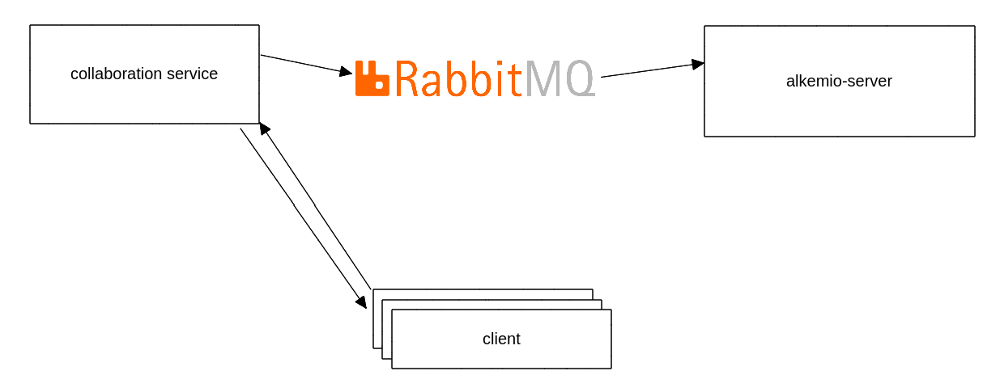

# Whiteboard collaboration service
A NestJS backend service to enable real-time collaboration on a whiteboards.

## Features
- Authentication & Authorization
- Inactivity tracker
- Contribution tracker
- Auto safe
- Real-time collaboration

## Implementation

1. A client is requesting to connect to the collaboration service.
The service will consult with the alkemio-server through a message queue who is this client.
If the client is authenticated the client can join.
2. A client is requesting to collaborate on a whiteboard.
The service will consult with the alkemio-server through a message queue if this client is authorized to do so.
3. If the client is authorized, the alkemio-server will return information regarding the whiteboard
- the access levels
- is it multi-user
- how many users can collaborate at a time
- the collaboration level of the client
4. Trackers
- Inactivity - If the user hasn't been activty for a while, based on inactivity interactions with the whiteboard,
the service will reduce the collaboration level to view-only.
The client is also notified of this change, so it can take proper actions, like changing the view, disabling controls, etc.
- Contributions - If the user has made contributions in a certain time window, the service will notify the alkemio-server,
so it can register a contribution.
- Auto save - The service will auto save the whiteboard state to the database on intervals.
The current implementation will ask users of the whiteboard, with the appropriate access in a random fashion to save it.